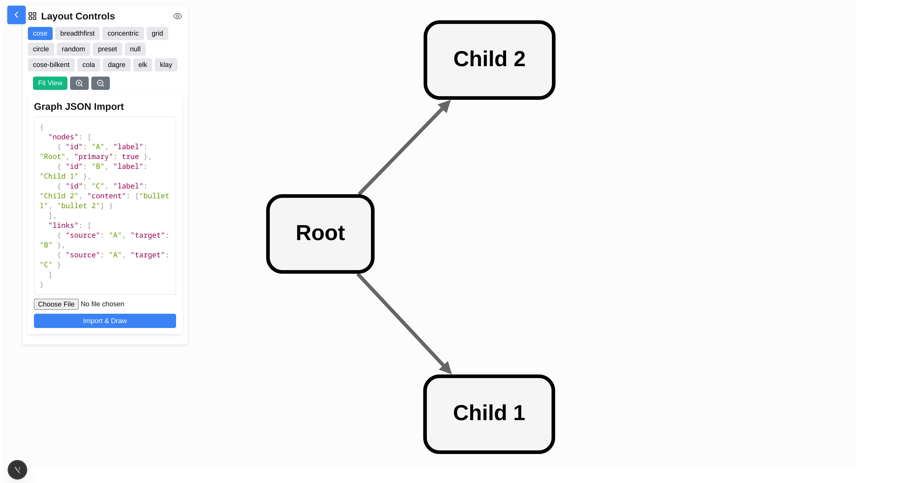
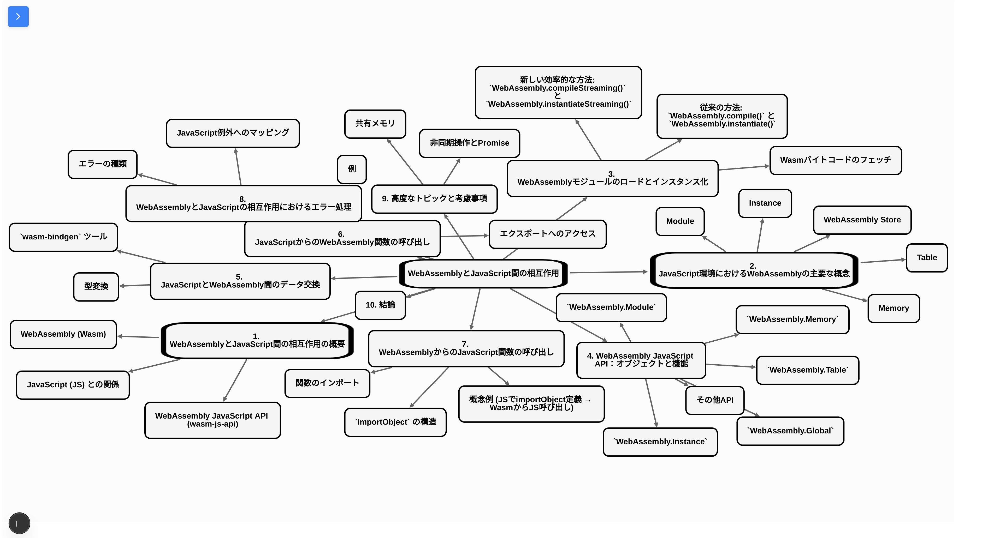

# next-cytoscape-demo

> **Cytoscape.js × Next.js** で “構造化ドキュメント → ネットワーク図” を即可視化できる  
> **Node-link形式のJSON** を貼り付けるだけのシンプルなデモアプリです。

<div align="center">
  
</div>

## 🚀 クイックスタート

```bash
pnpm install
pnpm build
pnpm start
````

**必要環境**： Node.js 18+ / pnpm 8+（or npm, yarn）

---

## 📦 JSON フォーマット

1. **node リスト**と **links リスト** で構成
2. ノードは `id` 必須。オプションで `label` / `primary` / `content`
3. リンクは `source` / `target` の 2 key


```jsonc
{
  "nodes": [
    { "id": "A", "label": "Root", "primary": true, "content": [] },
    { "id": "B", "label": "Child" }
  ],
  "links": [
    { "source": "A", "target": "B" }
  ]
}
```

node-link形式はD3.jsやNetworkxで用いられる一般的なグラフ構造を保存するためのデータ形式です: [参考](https://gist.github.com/mbostock/4062045)。さらに詳しい仕様・サンプルは **[`./assets/format_instruction.txt`](./assets/format_instruction.txt)** を参照してください。


## 🖼️ サンプル

* `Sample`（デフォルトロード）
* `Sample2` → `./assets/sample2.json`

<div align="center">
  
</div>


## 🛠️ 採用スタック

* **Next.js 13** (App Router) + **React 18**
* **TypeScript**
* **Cytoscape.js** + **react-cytoscapejs**
  * Layout Ext: cose-bilkent / cola / dagre / elk / klay
* **react-simple-code-editor** + **Prism.js**

## 🤝 ライセンス

MIT License
© 2025 Ackkerman
